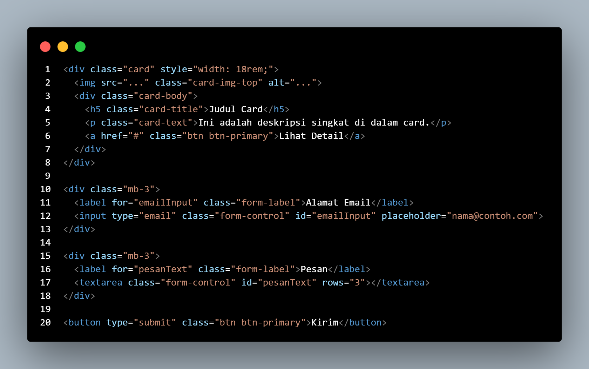

# Pratikum 6 - Twitter Bootstrap
### NAMA : Raihan Ardiansyah
### NIM : 312410396
### KELAS : TI.24.A3

**Pengantar Twitter Bootstrap**

**Apa itu CSS Framework?**

Pada Praktikum 4: CSS Layout1, kita telah belajar cara membuat layout web secara manual. 
Kita menggunakan properti CSS seperti float 2222, padding 3, margin 4,dan clear 5 
untuk mengatur posisi dan tampilan elemen. Pendekatan ini memberikan kontrol penuh, namun bisa
memakan waktu dan rumit, terutama untuk membuat layout yang responsive (tampil baik di
berbagai ukuran layar).

Sebuah CSS Framework adalah kumpulan file CSS dan JavaScript yang sudah jadi dan siap
pakai, yang menyediakan berbagai style dan komponen untuk mempercepat proses development.
Kita tidak perlu lagi menulis semua CSS dari nol.

**Apa itu Twitter Bootstrap?**

Bootstrap adalah CSS framework paling populer di dunia. Awalnya dikembangkan oleh Twitter,
Bootstrap menyediakan kumpulan komponen antarmuka (UI) dan grid system yang responsive
dan mobile-first.

Dengan Bootstrap, kita bisa membuat layout yang kompleks seperti di Praktikum 4 66 hanya
dengan menambahkan class HTML yang sudah ditentukan, tanpa menulis banyak CSS kustom.

**Setup Bootstrap (Menggunakan CDN)**

Kita akan menggunakan Bootstrap melalui CDN (Content Delivery Network). Ini mirip dengan
cara kita menyertakan file JavaScript eksternal7. 
Kita perlu menyertakan file CSS di <head> dan file JavaScript di akhir <body>.

(Catatan: meta viewport sangat penting agar responsiveness Bootstrap berfungsi di perangkat
mobile).

**Materi Praktikum**

1. Container

Bootstrap mengharuskan konten dibungkus di dalam container untuk mengatur lebar dan
perataan.

● .container: Memberikan lebar maksimum yang tetap (fixed-width) yang berubah pada
ukuran layar tertentu.

● .container-fluid: Memberikan lebar penuh (full-width) 100%.

2. Grid System (Sistem Grid)

Ini adalah fitur inti Bootstrap yang menggantikan float manual9999. Sistem grid Bootstrap
menggunakan 12 kolom.

● .row: Pembungkus untuk kolom. Ini menggantikan kebutuhan akan clearfix10.

● .col: Menandakan sebuah kolom. Jika hanya .col, lebarnya akan dibagi rata.

● .col-{angka}: Menentukan lebar kolom dari 1 sampai 12. Contoh: .col-4 berarti lebar 4/12
(sepertiga).

● .col-{breakpoint}-{angka}: Menentukan lebar kolom pada ukuran layar tertentu (misal: md
untuk medium).

Contoh Grid:

Membuat 3 kolom sama lebar yang di layout Praktikum 4 11harus menggunakan float: left12. Di
Bootstrap, caranya:

(Catatan: col-md-8 berarti di layar medium ke atas, lebarnya 8 kolom. Di layar kecil, lebarnya
otomatis jadi 100% dan menumpuk ke bawah).

3. Komponen: Button (Tombol)

Bootstrap menyediakan berbagai style tombol.

4. Komponen: Navbar (Navigasi)

Membuat navigasi responsive yang bisa collapse (menjadi menu hamburger di mobile) sangat
mudah.

5. Komponen: Card (Kartu)

Card adalah container konten yang fleksibel, menggantikan widget box 13131313atau box 1414 dari
Praktikum 4.

6. Komponen: Form (Formulir)

Bootstrap men-styling elemen form agar terlihat rapi dan konsisten. Ini jauh lebih mudah
daripada men-style form manual seperti di Praktikum 5.15.

● form-label:Memberi styling pada label.

● form-control: Memberi styling pada input, textarea, select.

● mb-3: Adalah utility class untuk memberi marginbottom: 3 (spasi).

**Pertanyaan dan Tugas**

